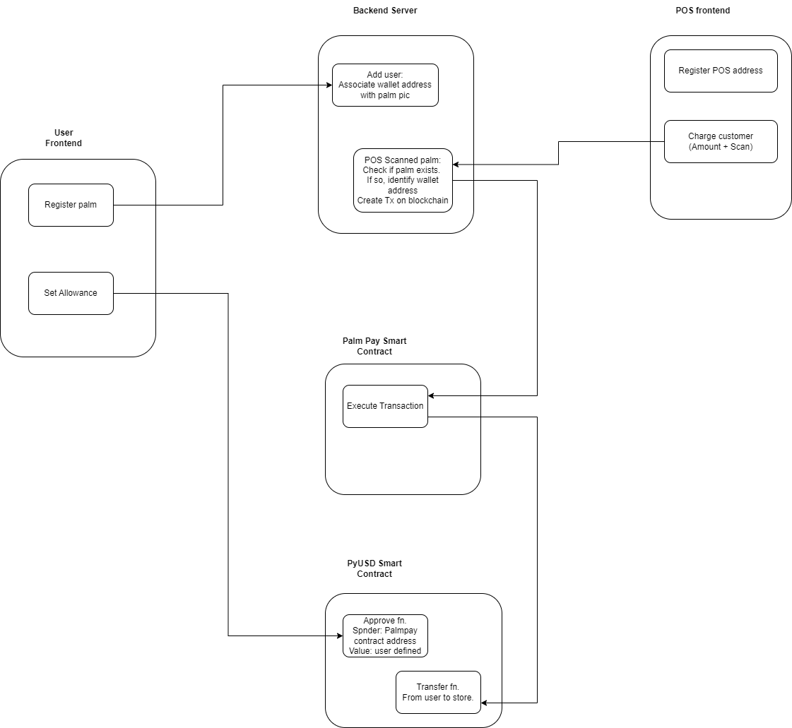

## Palm Pay
Pay for things in physical stores only using your palm. Works even if you forgot your wallet and phone at home.

Payments are done only using a stablecoin: PyUSD. Users can set a max amount for such automatic palm payments.

## Architecture

This project has a backend server that stores and authenticates palm images, and also executes transactions.

The customer's interface allows them to register palm and set max allowance for PalmPay's smart contract to spend their PyUSD.

The store's interface allows them to enter amount to charge and then scan the customer's palm. If there's a verified palm then the server will create a transaction. As long as the amount is within the user's allowance it'll go through.

## Disclaimer
Don't use this in production. At least not yet.
